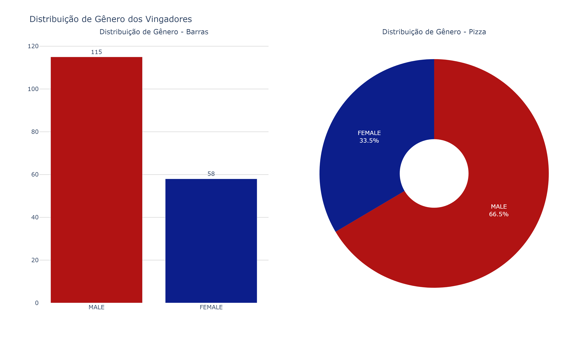
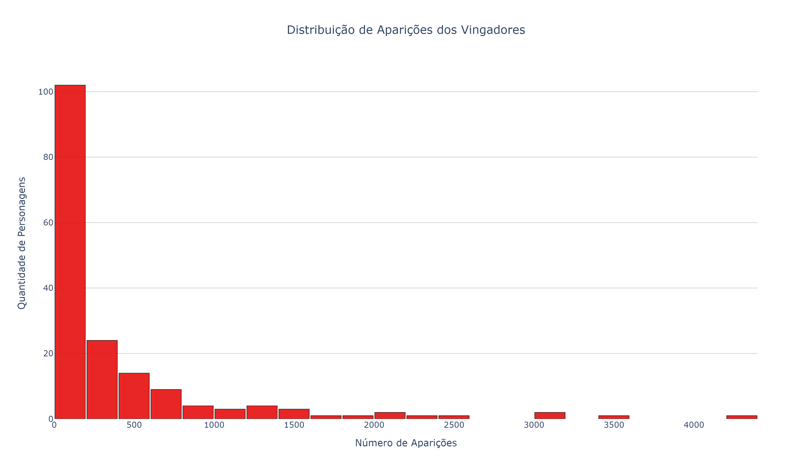
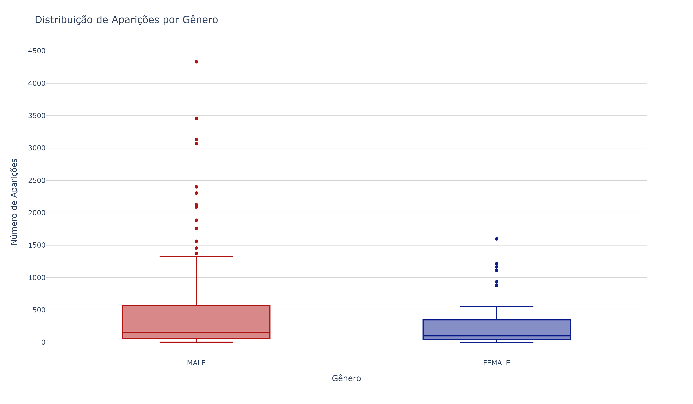
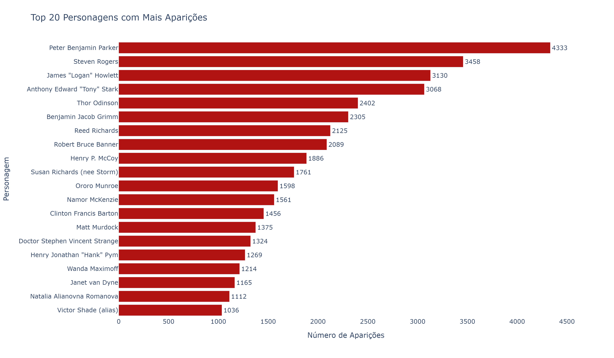
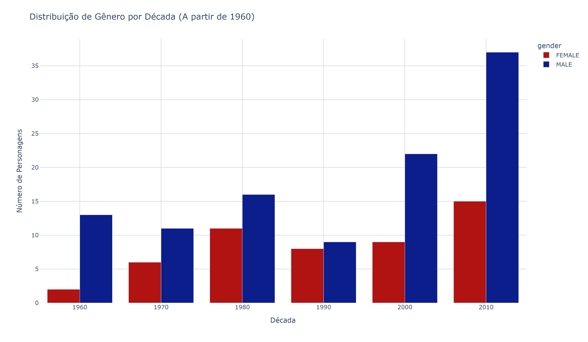
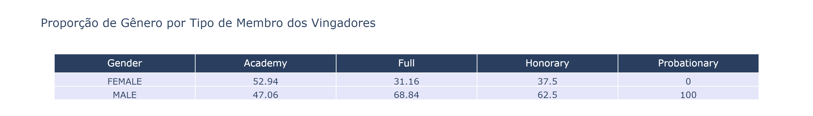
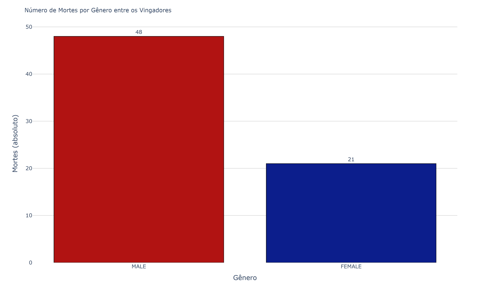
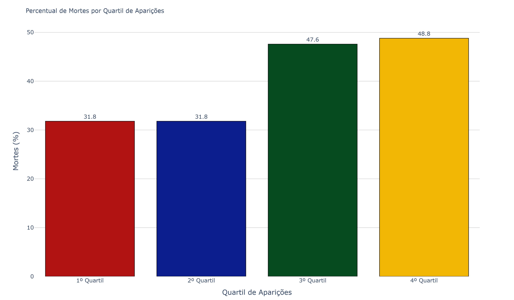
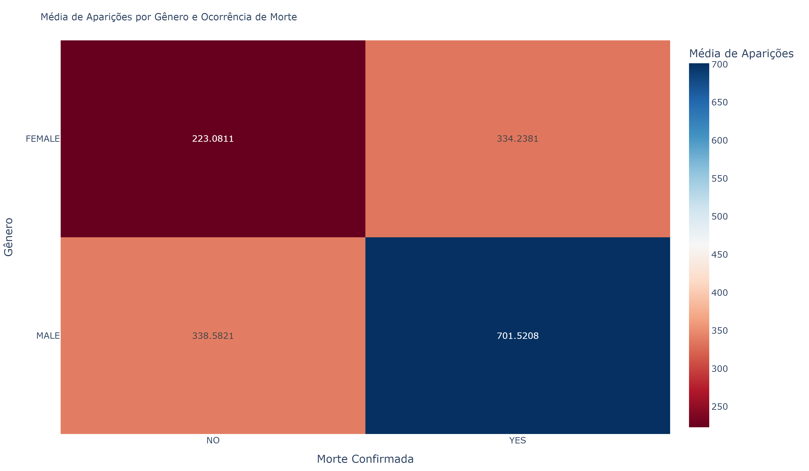

# 🦸‍♂️ Análise Exploratória de Dados dos Vingadores: Padrões de Mortalidade e Ressurreição

## 📌 Sobre o Projeto

**Explorando representatividade, recorrência e impacto narrativo nas HQs da Marvel**

Este projeto tem como objetivo realizar uma análise exploratória e narrativa do universo dos Vingadores com base em dados disponibilizados pelo portal FiveThirtyEight. Por meio de visualizações e interpretação dos padrões, investigamos a construção narrativa dos personagens da Marvel ao longo do tempo, com atenção especial à representatividade de gênero, popularidade, evolução da equipe e mortalidade.

## 🎯 Objetivos

- Explorar a frequência de aparições dos heróis.
- Analisar representatividade de gênero.
- Investigar o status dos membros (Full, Honorary, Academy...).
- Observar padrões de mortalidade e ressurreição.
- Estudar a evolução temporal da formação da equipe.

## 🗃️ Visão Geral dos Dados

| Coluna               | Descrição                                           |
|----------------------|----------------------------------------------------|
| `name`               | Nome do personagem                                 |
| `appearances`        | Número de aparições nos quadrinhos                 |
| `current`            | Status atual (vivo, morto, desaparecido, etc.)     |
| `gender`             | Gênero do personagem                               |
| `death1`, `death2`...| Indica se o personagem morreu (1) ou não (0)       |
| `return1`, `return2`| Indica se o personagem retornou após a morte       |
| `years_since_joining`| Tempo desde que entrou para os Vingadores          |
| `honorary`           | Membro honorário? (Sim/Não)                        |
| `full_reserve`       | Status na equipe (Full, Reserve, Academy, etc.)    |
| `year`               | Ano de entrada na equipe                           |

## 🎲 Análise Exploratória de Dados (EDA)

#### 📊 1. Quantos heróis compõem o conjunto de dados?
O dataset contém **173 personagens** associados ao grupo dos Vingadores. Essa amostra engloba desde membros fundadores até heróis mais recentes que integraram a equipe com o passar das décadas.

#### 🔍 2. Qual a distribuição de gênero dos personagens?


- Homens: 115 personagens (66,5%)
- Mulheres: 58 personagens (33,5%)

Apesar de um crescimento da presença feminina ao longo dos anos, a predominância de personagens masculinos é clara. Essa distribuição desigual nos mostra como a representação nas narrativas em quadrinhos ainda enfrenta desafios, mesmo com avanços recentes.

#### 📈 3. Qual é a média de aparições dos personagens?


- **Média geral:** 414,05 aparições

**75% dos personagens têm menos de 500 aparições.** O dado revela uma distribuição desigual de visibilidade entre os personagens. Embora a média seja alta, ela é inflacionada por poucos heróis com milhares de aparições. A maioria dos personagens participa de poucas histórias, enquanto alguns personagens centrais dominam o universo Marvel com presença recorrente.

#### 📊 4. Distribuição de aparições por gênero


- Homens: média de 490 aparições
- Mulheres: média de 263 aparições

Além de serem maioria, os personagens masculinos aparecem com mais frequência, o que reforça a **centralidade dos homens nas histórias principais**. A variação de aparições entre os homens é significativamente maior, refletindo papéis mais diversos e de destaque. As mulheres, em contrapartida, apresentam média mais baixa e menor dispersão, sugerindo papéis mais secundários

#### 🏆 5. Quais personagens aparecem com mais frequência?


A análise das aparições mostra que os personagens mais presentes nas edições da Marvel são figuras centrais do universo dos Vingadores. O top 5 é composto por heróis extremamente populares e com papel recorrente nas histórias:
1. Peter Parker (Homem-Aranha)
2. Steven Rogers (Capitão América)
3. James Logan Howlett (Wolverine)
4. Tony Stark (Homem de Ferro)
5. Thor

Esses heróis não apenas são centrais nas histórias em grupo, mas também protagonizam séries solo, o que contribui para o elevado número de aparições. O destaque do Homem-Aranha como o mais presente mostra sua transversalidade nas narrativas da Marvel.

#### 📅 6. Como a adesão aos Vingadores evoluiu ao longo do tempo?


Houve uma explosão de novos membros a partir dos anos 2000, especialmente entre 2010 e 2015. Esse crescimento coincide com a ascensão do Universo Cinematográfico da Marvel (MCU), sugerindo uma convergência entre as mídias e uma estratégia de expansão da base de personagens nas HQs para refletir o sucesso dos filmes.

#### 🚀 7. Evolução da Representatividade de Gênero por Década


- Décadas de 1960: mais de 6 homens para cada mulher
- Década de 2010: proporção cai para 2,5 homens para cada mulher

Apesar de os personagens masculinos continuarem em maior número, é visível um avanço na inclusão feminina, especialmente nas décadas mais recentes. Esse avanço acompanha movimentos sociais por maior representatividade nas mídias, ainda que o ritmo do crescimento masculino continue mais acelerado.

#### 🎓 9. Diferença entre os gêneros nas categorias de membros


As categorias de membros dos Vingadores ajudam a compreender a posição narrativa dos personagens:
- **Full**: membros oficiais, com participação ativa nas histórias e missões dos Vingadores. São os "principais" heróis.
- **Honorary**: membros honorários, que já ajudaram os Vingadores, mas não fazem parte oficialmente do grupo.
- **Academy**: membros em treinamento, geralmente jovens heróis sendo preparados para futuramente se tornarem membros plenos.
- **Probationary**: membros em período de teste, com participação limitada até se provarem aptos a se tornar membros completos.

A categoria **Probationary** é composta 100% por homens, sugerindo um possível viés na atribuição dessa função narrativa.

A categoria **Honorary** apresenta uma leve maioria feminina, o que pode indicar uma maior disposição de personagens mulheres em papéis auxiliares, mas não de protagonismo ativo.

#### 💀 10. Mortalidade e Ressurreição por Gênero


- Personagens masculinos morrem mais, mas...
- Mulheres têm maior taxa de retorno (ressurreição)

Isso pode indicar que, ao contrário do esperado, personagens femininas mortas ganham mais valor narrativo ao serem recuperadas, talvez como forma de compensar sua menor presença geral. Já os homens, mesmo sendo mais recorrentes, são menos frequentemente "ressuscitados", talvez por já terem cumprido seus papéis centrais.

#### 📉 11. Mortalidade por Quartil de Aparições


- Personagens com mais aparições morrem mais.
- A mortalidade sobe para quase 49% nos personagens com mais presença.

Isso desafia o senso comum de que personagens populares são "protegidos" narrativamente. Na verdade, sua centralidade os torna mais suscetíveis a arcos de sacrifício ou reviravoltas dramáticas.

#### 📊 12. Aparições x Morte x Gênero


- Entre os homens, personagens mortos têm mais que o dobro de aparições dos vivos.
- Entre as mulheres, mesmo as mortas aparecem menos que homens vivos.

Ou seja, **a morte está fortemente ligada à importância do personagem**, mas essa relação ainda carrega um viés de gênero. Mulheres, mesmo quando "importantes o suficiente para morrer", ainda são menos visíveis que os homens.

### ✅ Conclusão

A análise do universo dos Vingadores vai além da simples contagem de aparições ou classificações por gênero. Ela nos oferece um espelho das escolhas narrativas, culturais e comerciais feitas ao longo das décadas — refletindo tanto as limitações quanto os avanços na forma como heróis e heroínas são retratados.

Por meio da estatística descritiva e da visualização de dados, conseguimos enxergar padrões que nem sempre são visíveis à primeira leitura de uma HQ:
- A representatividade feminina, embora crescente nas últimas décadas, ainda é marcadamente inferior à masculina — tanto em número quanto em protagonismo.
- A concentração de visibilidade em poucos personagens, geralmente homens, revela uma estrutura narrativa centrada em figuras recorrentes, que dominam as histórias e as memórias dos leitores.
- A morte não representa o fim narrativo, principalmente para personagens populares, que retornam em ressurreições simbólicas — o que evidencia seu valor estratégico para as histórias e para o público.
- A evolução do grupo dos Vingadores acompanha os movimentos sociais e o contexto midiático: a inclusão de novos membros acelera em décadas com forte presença do universo cinematográfico, evidenciando o impacto da cultura pop no cânone dos quadrinhos.

Este projeto mostra como a estatística pode ser uma poderosa ferramenta para análise narrativa. Quando aliada à visualização de dados e ao pensamento crítico, ela permite revisitar universos fictícios com um olhar mais atento e questionador — revelando o que está nas entrelinhas das histórias que consumimos há gerações.

### 📁 Estrutura do Projeto

```bash
📦 eda-vingadores
├── 📊 vingadores_eda.ipynb        # Notebook com toda a análise
├── 📈 imagens/                    # Gráficos exportados para o README e apresentações
├── 📄 README.md                   # Documento explicativo do projeto
└── 📂 dados/
    └── vingadores.csv            # Dataset original usado na análise
```
